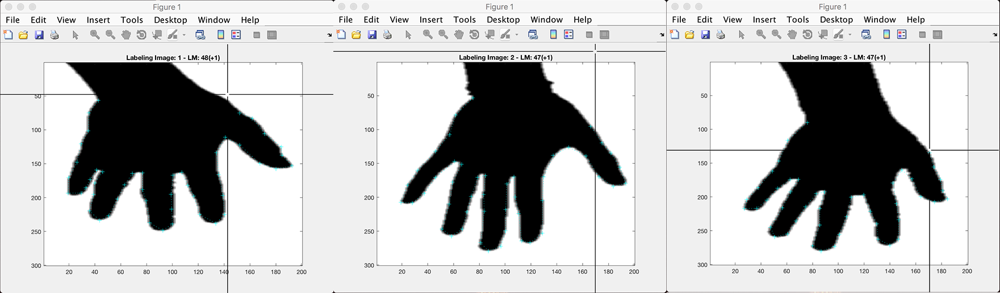
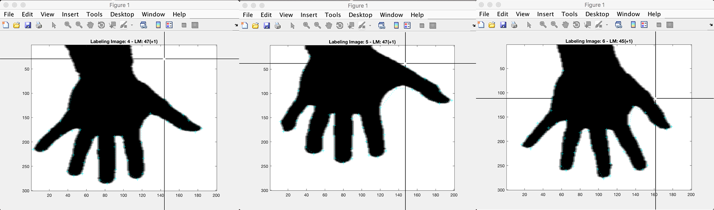
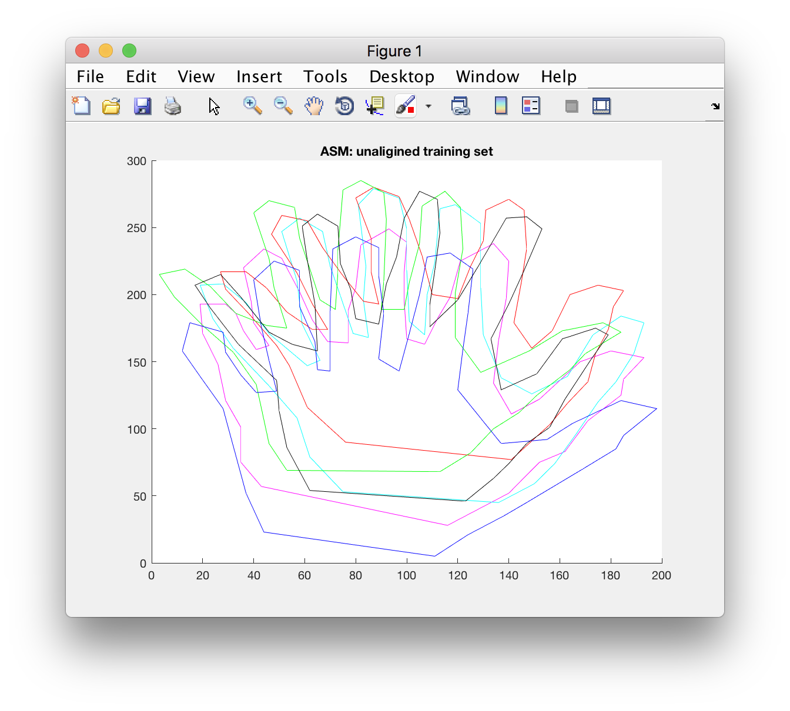
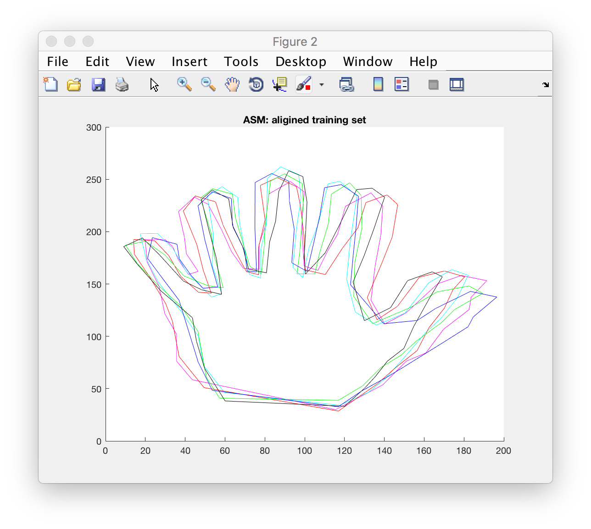
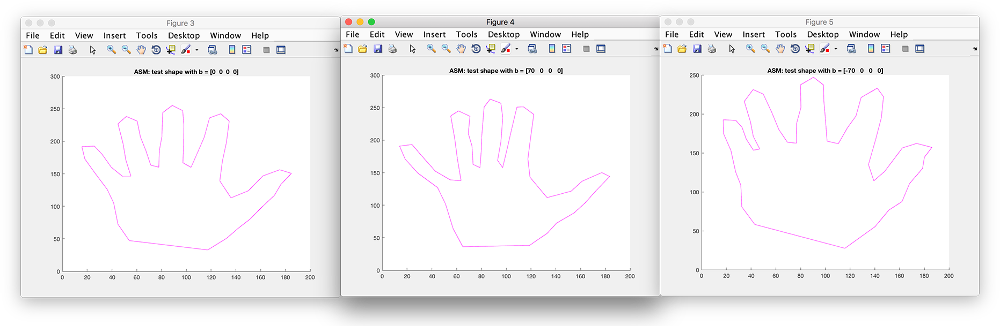
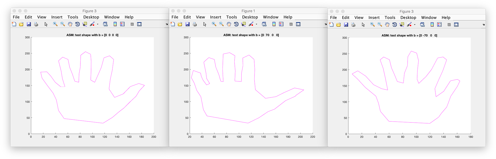
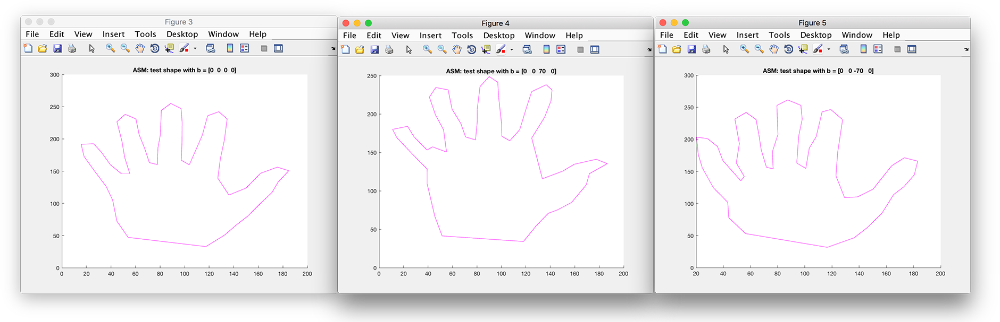
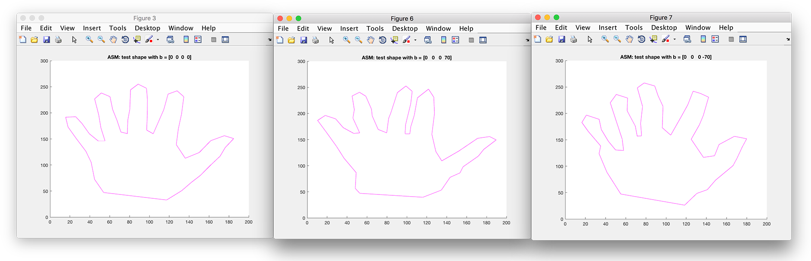
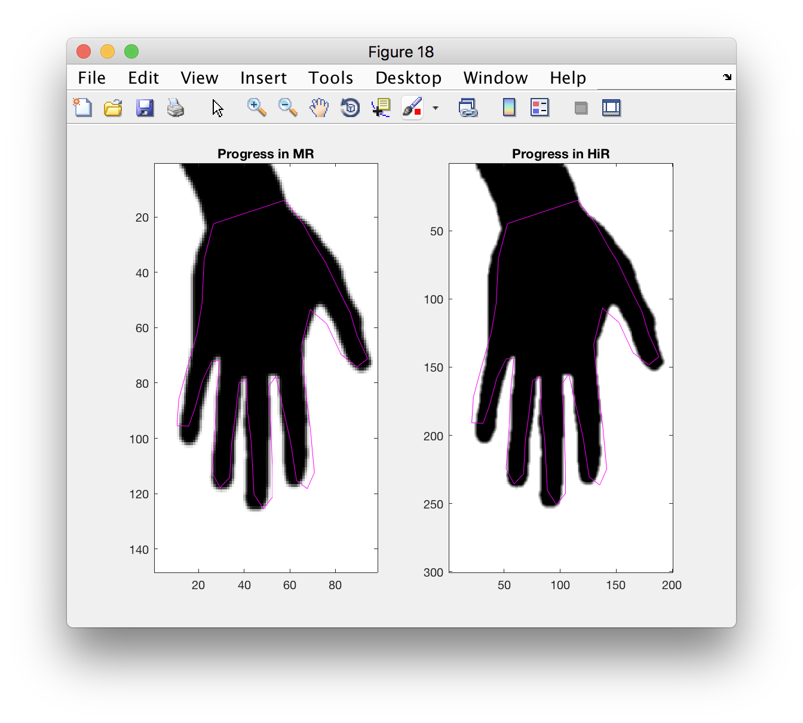

# Active Shape Model

>  Report for Lab 1, Human-Computer Interaction by Dr. Ying SHEN
>
>  Yang LI(1452669)
>
>  Open Sourced on [GitHub](https://github.com/zjzsliyang/Transfiguration) under MIT License

## Requirement

- Train the ASM.
- Save the result to a file.
- Try weights.
- Try the third stage and try to search for the trained shape in a new image.
- (optional) Test for three sets of grayscale images.

Describe what is done during the three stages. That is, relate what is done to the theory about ASM and describe shortly what is computed etc. during the stages. Give also a short description of what you did, problems you saw, and include an image of the result.

Answer the following question in the report:

Trying weight: How each mode affects the hand shape by adjusting its value(refer to the weighting factors in Page 8)? Please also take a screenshot of result image to illustrate.

## Tutorial

#### Suitable Landmarks

To build a statistical model of hand we require a set of annotated images of typical examples(like the several hand images). We must first decide upon a suitable set of landmarks which describe the shape of the hands and which can be found reliably on every training image.

The chosen of good landmarks is very import in ASM, these should be easy to identify and mark in each image. This constrains the sorts of applications to which the method can be applied - it requires that the topology of the object cannot change and that the object is not so amorphous that no distinct landmarks can be applied.

Good choices for landmarks are points at clear corner of object boundaries, according to [1], 'T' junctions between boundaries or easily located bilolgical landmarks. However, there may be rarely enough of such points to give more than a sparse description of the shape of the target object. Points along boundaries which are arranged to be equally spaced between well defined landmark points are show as follows[1].

To represent the shape we must also record the *connectivity* define how landmarks are joined to form the boundaries in the image. This allows us to determine the direction of the boundary at a given point. Suppose the landmarks along a curve are labelled $\{(x_1, y_1), (x_2, y_2), \dots,(x_n, y_n)\}$(in this case, $n = 50$).

For a 2-D image we can represent the $n$ landmark points, $\{(x_i, y_i)\}$, for a single example as the $2n$ element vector, $x$, where

$x = (x_1, \dots, x_n, y_1, \dots, y_n)^T$

If we have $s$(in this case, $s=6$) training examples, we generate $s$ such vectors $x_j$. 

Actually in the given six images, I annotated with $50$ Landmarks as follows.

Before we can perform statistical analysis on these vectors it is important that the shapes represented are in the same co-ordinate frame. The shape of an object is normally considered to be independent of the position, orientation and scale of that object.

We use **Procrustes Analysis** to align a set of training shapes into a commin co-ordinate frame. The approach is to translate, rotate and scale each shape so that the sum of distances of each shape to the mean $D = \sum|x_i-\bar{x}|^2$ is minimised.

To implement, we use translation, uniform scaling, rotation and shape comparison in order.

Calculate the mean of these samples, where

$\bar{x} = \frac{\sum_{i=1}^k x_i}{k}, \ \ \bar{y} = \frac{\sum_{i=1}^k y_i}{k}$

Likewise, the sacle component can be removed by scaling the object so that the root mean square distance from the points to the translated origin is $1$. This root mean square distance is a statistical measure of the object's scale or size:

$s = \sqrt{\frac{\sum_{i=1}^k (x_i-\bar{x})^2}{k}}$

And then divede the point co-ordinate by object's initial scale.

A rotation by angle $\theta$ is gived as:

$\theta = \arctan (\frac{\sum_{i=1}^k(w_iy_i-z_ix_i)}{\sum_{i=1}^k(w_ix_i+z_iy_i)})$

Procrustes distance which is the square root of the sum of squared distances between corresponding points can be used as a statistical measure of this difference in shape:

$d = \sqrt{(u_1-x_1)^2+(v_1-y_1)^2+\dots}$

In practice, before Procrustes Analysis(unaligned):

After Procrustes Analysis(aligned):

#### Statistical Models of Shape

Now we have $s$ sets of points $x_i$ which are aligned into a commin co-ordinate frame. To simplify the problem and count down the compute, we should reduce the dimensionality of the data from $2n$ to something more manageable. An effective approach is to apply **Principle Component Analysis(PCA)** to the data. Approcimate the training set, $x$ using

$x \approx \bar{x} + Pb$

where $P = (P_1 | P_2 | \dots | P_t)$ contains $t$ eigenvectors of the covariance matrix and $b$ is a $t$ dimensional vector given by

$b = P^T(x-\bar{x})$

The vector $b$ defines a set of patameters of deformable model. By varying the elements of $b$ we can vary the shape $x$. The variance of the $i^{th}$ parameter, $b_i$, across the training set is given by $\lambda_i$. By applying limits of $\pm 3\sqrt{\lambda_i}$(the limit chosen takes [2] for reference) to the patameter $b_i$ we ensure that the shape generated is similar to those in the original training set.

We usually call the model variation correspondign to the $i^{th}$ parameter, $b_i$, as the $i^{th}$ mode of the model. The eigenvectors, $P$, define a rorated co-ordinate frame, aligned with the cloud of original shape vectors. The vector $b$ defines points in this roteted frame.

Thus in this case the use of PCA reduced the dimension of the shape vectors from $100$ to $4$, and can explain $90\%$ of the variance in the landmark positions in the training set. When I apply the alignment and PCA as described above, I generated a model.

#### Examples of Shape Models

Next figures shows the effect of varying the four shape  parameters in turn between $\pm70$ standard deviations from the mean value, leaving other parameters at zero.

Compared the figures show above, the first principal component may represents that thumb and pinkie's distance against the other fingers, the larger value reflects the large spacing of  thumb and pinkie's distance.

The second principal component may be a little confused, I guess it shows the radian of the thumb and pinkie versus the other four fingers distance.

With observation, we can see the third principal component means the size of palm.

The fourth principal component is also obvious, which mirrors the distance of index finger and middle finger against ring finger and middle finger. 

#### Fitting a Model to New Points

A particular value of the shape vector, $b$, corresponds to a point in the rotated space described by $P$. It therefore corresponds to an example model. This can be turned into an example shape using the tranformation from the model coordinate to the image coordinate frame. Typically this will be euclidean transformation defining the position, $(X_t, Y_t)$, orientation, $\theta$, and scale, $s$, of the model in the image.

The positions of the model points in the image, $X$, are then given by

$X = T_{X_t, Y_t, s, \theta}(\bar{x}+Pb)$

Where the function $T_{X_t, Y_t, s, \theta}$ performs a rotation by $\theta$, a scaling by $s$ and a translation by $(X_t, Y_t)$. For instance, if applied to a single point $(x, y)$.

$T_{x_t, Y_t, s, \theta} (_y^x) = (_{Y_t}^{X_t}) + (_{s\sin\theta\ s\cos\theta}^{s\cos\theta\ -s\sin\theta})(_y^x)$

Suppose now we wish to find the best pose(translation, scale and rotation) and shape parameters to match a model instance $X$ to a new set image points, $Y$. Minimising the sum of square distances between corresponds model and image points is equivalent to minimising the expression

$|Y - T_{X_t, Y_t, s, \theta}(\bar{x}+Pb)|^2$

What I set in terms:

|                 Term                 | Data |
| :----------------------------------: | :--: |
|        initial scaling factor        |  1   |
|     initial rotation in degrees      | -2.5 |
|     initial x(right) translation     |  -3  |
|     initial y(down) translation      |  0   |
|              MR levels               |  2   |
| max number of loops for image search | 100  |
|       above points fot search        |  9   |
|       below points fot search        |  9   |

Results are show as follows:

As you can see,  instances of models can only deform in ways found in a training set, which is ASM algorithm's advantage, it allows for considerable variability but are still specific to the class of objects or structures they intend to represent.

ASMs outperforms other deformable models in that it only produces allowable shapes regardless of the level of the noise in an image. The allowable shapes are those whose variations are covered within the training set of images. This suggests that our training set should contain instances of the object to be modeled with only the variability that needs to be modeled. A second advantage is that the algorithms that employ ASMs are general, which means that the same software can be used for a wide variety of
applications such as medical an industrial.

## Reference

[1] Ed.R.Baldock,  J.Graham: Model-Based Methods in Analysis of Biomedical Images, Image Processing and Analysis, Oxford University Press, 2000.

[2] T.F. Cootes, C.J. Taylor, D.H. Cooper, J. Graham: [Active Shape Models-Their Training and Application](http://www.sciencedirect.com/science/article/pii/S1077314285710041?via%3Dihub), Computer Vision and Image Understanding, 1995.

[3] B. van Ginneken, A.F. Frangi, J.J. Staal, B.M. ter Haar Romeny, M.A. Viergever: [Active Shape Model Segmentation with Optimal Features](http://ieeexplore.ieee.org/abstract/document/1076037/), IEEE, 2002.

[4] Sami Romdhani, Shaogang Gong, Alexandra Psarrou: [A Multi-View Nonlinear Active Shape Model Using Kernel PCA](http://www.bmva.org/bmvc/1999/papers/48.pdf), University of Westminster, 1999.

[5] Ghassan Hamarneh, [Active Shape Models: Modeling Shape Variations and Gray Level Information and an Application to Image Search and Classification](https://pdfs.semanticscholar.org/5b34/59be44b9eb7d8679ba348db4dfabcd5a8522.pdf), Chalmers University of Technology, 1998.