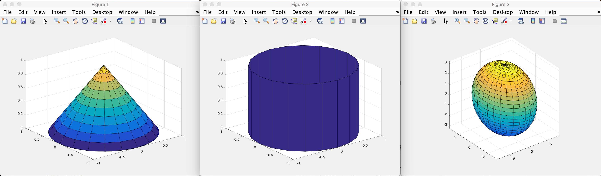
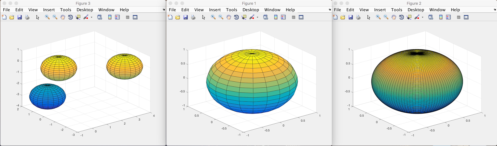
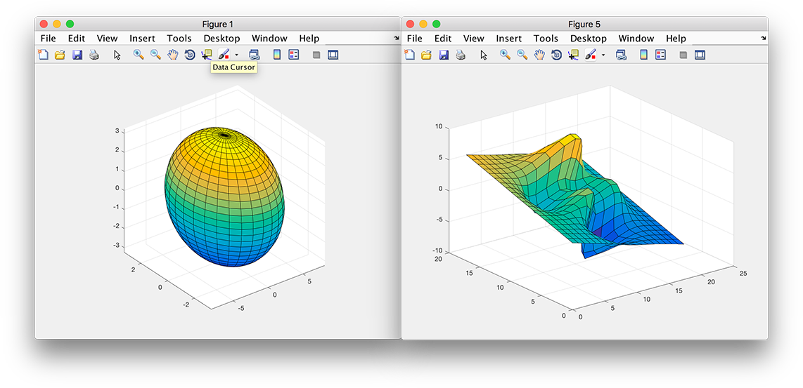
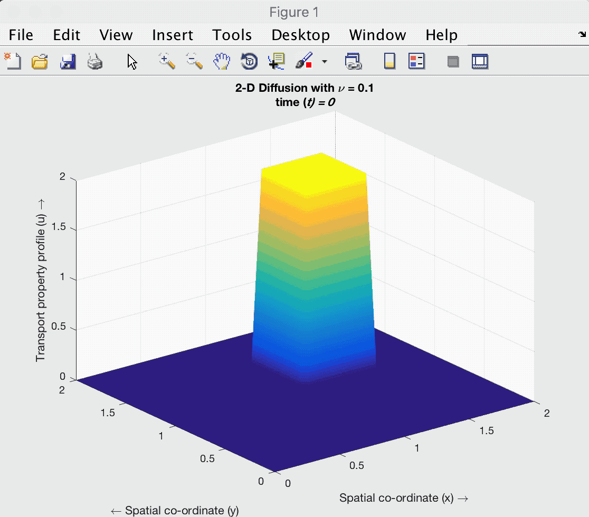
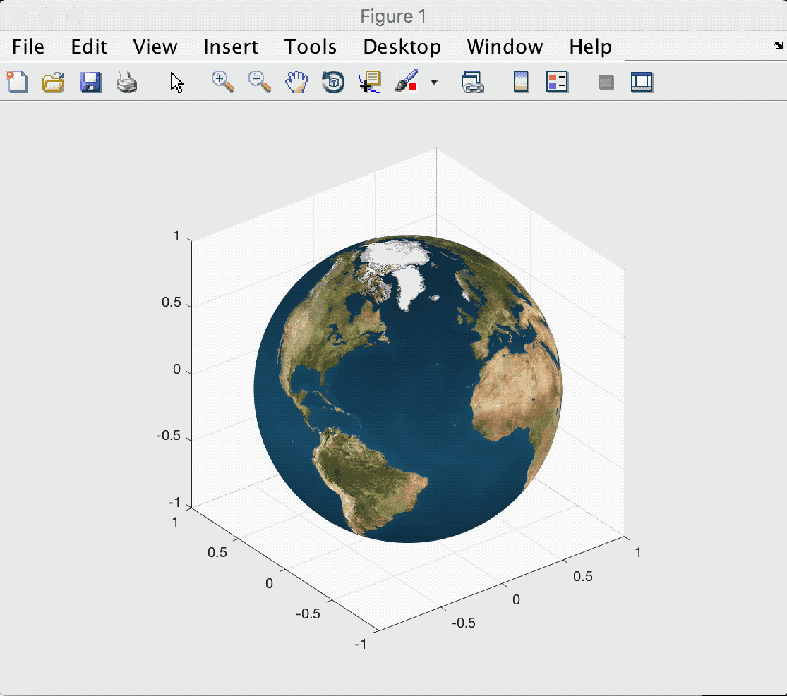

# Drawing 3D Object

>  Report for Lab 2, Human-Computer Interaction by Dr. Ying SHEN
>
>  Yang LI(1452669)
>
>  Open Sourced on [GitHub](https://github.com/zjzsliyang/Transfiguration) under MIT License

## Requirement

- Run previous examples
- Draw a sphere on the screen
- The sphere will automatically rotate.

## Tutorial

**This document includes .gif format, use md or html to get a better user experience.**

As the MATLAB documents introducts:

> The `sphere` function generates the *x*-, *y*-, and *z-* coordinates of a unit sphere for use with `surf` and `mesh`.
>
> `sphere` generates a sphere consisting of 20-by-20 faces.
>
> `sphere(n) `draws a `surf` plot of an n-by-n sphere in the current figure.
>
> `sphere(ax,...)` creates the sphere in the axes specified by `ax` instead of in the current axes. Specify `ax` as the first input argument.
>
> `[X,Y,Z] = sphere(...) `returns the coordinates of the n-by-n sphere in three matrices that are (n+1)-by-(n+1) in size. You draw the sphere with `surf(X,Y,Z)` or`mesh(X,Y,Z)`.

### Reproduce the examples

It is simple to reappear the example in the my laptop, run the file and the results are as follows:







### Draw a new sphere

To draw a new sphere, I not only just draw a graph, but also make a model for a diffusion equation simulated using finite differencing methods in my MCM contest.

Here is the code(with Dirichlet Boundary Condition):

```matlab
%Initial Conditions
for i=1:nx
    for j=1:ny
        if ((1<=y(j))&&(y(j)<=1.5)&&(1<=x(i))&&(x(i)<=1.5))
            u(i,j)=2;
        else
            u(i,j)=0;
        end
    end
end

%%
%B.C vector
bc=zeros(nx-2,ny-2);
bc(1,:)=UW/dx^2; bc(nx-2,:)=UE/dx^2;  %Dirichlet B.Cs
bc(:,1)=US/dy^2; bc(:,ny-2)=UN/dy^2;  %Dirichlet B.Cs
%B.Cs at the corners:
bc(1,1)=UW/dx^2+US/dy^2; bc(nx-2,1)=UE/dx^2+US/dy^2;
bc(1,ny-2)=UW/dx^2+UN/dy^2; bc(nx-2,ny-2)=UE/dx^2+UN/dy^2;
bc=vis*dt*bc;

%Calculating the coefficient matrix for the implicit scheme
Ex=sparse(2:nx-2,1:nx-3,1,nx-2,nx-2);
Ax=Ex+Ex'-2*speye(nx-2);        %Dirichlet B.Cs
Ey=sparse(2:ny-2,1:ny-3,1,ny-2,ny-2);
Ay=Ey+Ey'-2*speye(ny-2);        %Dirichlet B.Cs
A=kron(Ay/dy^2,speye(nx-2))+kron(speye(ny-2),Ax/dx^2);
D=speye((nx-2)*(ny-2))-vis*dt*A;

%%
%Calculating the field variable for each time step
i=2:nx-1;
j=2:ny-1;
for it=0:nt
    un=u;
    h=surf(x,y,u','EdgeColor','none');       %plotting the field variable
    shading interp
    axis ([0 2 0 2 0 2])
    title({['2-D Diffusion with {\nu} = ',num2str(vis)];['time (\itt) = ',num2str(it*dt)]})
    xlabel('Spatial co-ordinate (x) \rightarrow')
    ylabel('{\leftarrow} Spatial co-ordinate (y)')
    zlabel('Transport property profile (u) \rightarrow')
    drawnow; 
    refreshdata(h)
    %Uncomment as necessary
    %Implicit method:
    U=un;U(1,:)=[];U(end,:)=[];U(:,1)=[];U(:,end)=[];
    U=reshape(U+bc,[],1);
    U=D\U;
    U=reshape(U,nx-2,ny-2);
    u(2:nx-1,2:ny-1)=U;

    u(1,:)=UW;
    u(nx,:)=UE;
    u(:,1)=US;
    u(:,ny)=UN;
end
```

And the animation shows how it changes:



### Rotate Automaticly

To rotate a 3-D image, just use the ``rotate`` function, and put in a ``loop`` to keep on. Notice that, ``axis vis3d`` should be in the right position.

```matlab
direction = [0,0,1];
hsphere = surf(x,y,z, 'FaceColor', 'texturemap', 'CData', I, 'EdgeColor', 'none');
axis vis3d
for i = 1:1000
    rotate(hsphere, direction, 25);
    pause(0.1);
end
```

The result is showed as follow:



## Reference

[1] MATLAB document: [sphere](https://cn.mathworks.com/help/matlab/ref/sphere.html), updated 2016.

[2] Grossmann, Christian, Roos, Hans-G., Stynes, Martin: Numerical Treatment of Partial Differential Equations, 2007.

[3] wikipedia: [Finite difference method](https://en.wikipedia.org/wiki/Finite_difference_method).