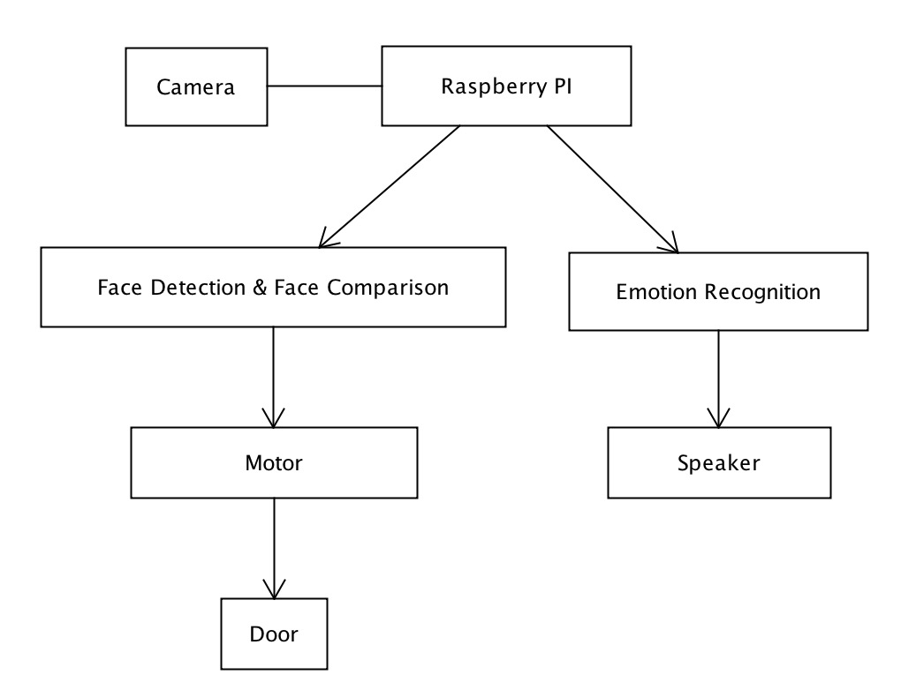

# Transfiguration
42034502 Spring2017 Human-Computer Interaction Project by Dr. [Ying SHEN](mailto:yingshen@tongji.edu.cn) @ SSE, TJU

## Bella Bell

a smart bell for IoT and smart home supporting iOS platform to controll your door and remind you with calendar and to-do list.

     

### How to Run

Just download the DoorBell from App Store, and run it!

or manually:

- Front-end
  - Install third-party frameworks via CocoaPods
  - Build the ``DoorBell.xcworkspace`` file
- Back-end
  - Install node modules via npm
  - Start the server via forever
- Hardware
  - ​

### Background

- Sometimes ourselves are kept out since forgot taking keys, so it is better that there is a way to open the door after the door recognize our faces or our fingerprints.
- When we in the room and someone knocks on the door, walked out of the room and confirmed the identity to open the door causes a lot of trouble. 
- People want to check whether the old and the child are at home to make sure they are out of dangerous at any time.
- It is better that you know who is at home when you are out so that you can ask he/she do you a favor at home.
- We hope we can celebrate when delighted or dispel annoyance when we are in trouble while there is only a silence.

### Functionality

- Unlock
  - unlock door with Face Recognition
  - unlock door with touchID
  - unlock door with QR Code
- Alert
  - Send Notification while meeting strangers
  - Chose to unlock or refuse while meeting strangers
- Agenda
  - Access your calendar and remind you when you leave
- Family
  - Notify when your following people leave or come in
  - Show the people in dormitory(home) in real time
- Others
  - Play a happy song when you arrive home with a good mood
  - Tell a joke when you arrive home with a bad mood

### Implemented Requirements

- Face Cognition
- IoT Project

### Structures & Modules

brief introduction 

#### Front-end

In the front-end, we now use Swift to develop an iOS & watchOS app.

We use the MVC Pattern, which represents Model, View, Controller to implement the separation of View and Model. Thus, we can realize the dynamic design of the program and increase the code reuse.

We use some Third-Party Frameworks via CocoaPods, which show as follows:

> Alamofire, Koloda, FSCalendar, SwiftyJSON, MBProgressHUD

You can see more details in the Podfile.

In the View layer, we use the Cocoa Touch Layer and its UIKit Framework to develop, make it convince to maintain the code. To improve the effectiveness, we have done a lot of things such as: Multithreaded parallelism, Native API, Automate code integration, optimizate certificate and signature mechanism. What's more, we use the UI Test and Unit Test to automate our workflow.

#### Back-end

In the back-end, we use express framework to build a node.js application. Here is the API:

|     URL     | Method |               Description                |
| :---------: | :----: | :--------------------------------------: |
|    /file    |  Post  |             upload the photo             |
|  /getFile   |  Get   |        get the photo from server         |
|   /unlock   |  Post  |         post the unlock message          |
| /getUnlock  |  Get   | get the unlock signal to decide open or not |
|  /present   |  Post  | post the people in room message in real time |
| /getPresent |  Get   |        get the people in the room        |
|    /data    |  Post  |        post the similarity value         |
|  /getData   |  Get   |            get the similarity            |

To run the node.js app in server as daemon, we use [forever](https://github.com/foreverjs/forever) CLI tool.

#### Cognitive Services

As we can see as following image, the whole architecture includes Raspberry PI, Camera, Cognitive Services, Electrical Machine, Voice Box and Door. The Raspberry PI controls the camera, when someone takes a photo using camera, the Raspberry PI will send the photo to Face Recognition (Detection & Comparison) and Emotion Recognition. Then, the Face Recognition will inform Electrical Machine to open the door, and the Emotion Recognition will inform Voice Box to play audio.



##### Opening Door Using Face

In Bella Bell, the first lightspot is that we can open our room door using our face. To achieve this, what we do shows as follows :

- Face Detection
- Face Comparison

###### Face Detection

In order to open the door using our own face, we need to stored all our roommates' photos in database and detect the face of these photos to get ``FaceID Array`` which represents the face of different photos and will be used in Face Comparison. Then, we will capture a new photo using camera when someone wants to open the door using his face, and the new photo also need to get ``FaceID`` which will also be used in Face Comparison. To achieve this, we need to call Cognitive Services API. The first time we used  Microsoft Cognitive Services, accociated code shows as follows: 

```python
def get_face_values(file_location):
	url = 'https://westcentralus.api.cognitive.microsoft.com/face/v1.0/detect'
	key = 'ca99486b8b8744ba96d756e105c8275c'
	data = open(file_location, 'rb').read()
	headers = {
		'Ocp-Apim-Subscription-Key':key,
		'Content-Type': 'application/octet-stream'
		}
	return requests.request("POST", url=url, data=data, headers=headers).json()
```

However, in the beta version, when we try to open our door, we found that the dectection process is so slow, which make us wait for a long time to get the door opened, it make us impatient. After analyzing, we found the reason is that Microsoft server set up in foreign countries, which make the dectect process slow. So, we changed to use Face++ Cognitive Services. The code shows as follows:

```python
def detect(imageFile):
    key = "LiRb3yg8xNdZ26KaaGWpBvocRntnNVpy"
    secret = "sfzfdDGKizGtGy9l-1c6-Yys9lz1Etmq"
	url = "https://api-cn.faceplusplus.com/facepp/v3/detect"
    file = open(imageFile,'rb').read()
    files = {
        #'Content-Type': 'multipart/form-data',
        'image_file' : file
    }
    params = {
        'api_key': key,
        'api_secret': secret,
        'return_attributes':'emotion'
    }
    res=requests.post(url,params=params,files=files).json()
    print res
```

As a result, we found that the speed of Face Detection improves visibly.

###### Face Comparison

After Face Dectection, the next step is to compare the photo captured by camera with photos stored in the database. We need to post FaceID-one(representing the photo from camera) and FaceID-two(representing one of photos stored in the database), then we will get the similarity back. Our rule is that if the similarity is greater than 70.0%, the door will open. Code using Microsoft Services as follow:

```python
def get_compare_value(id1):
    headers = {
    'Content-Type': 'application/json',
    'Ocp-Apim-Subscription-Key': 'ca99486b8b8744ba96d756e105c8275c',
    }
    id2 = '815a7784-676a-43aa-a215-beb7b1230760'
    body = {'faceId': id1, 'faceIds': [id2]}

    conn = httplib.HTTPSConnection('westcentralus.api.cognitive.microsoft.com')
    conn.request("POST", "/face/v1.0/findsimilars?%s" % params, json.dumps(body), headers)
    response = conn.getresponse()
    data = response.read()
    dataJson = json.loads(data)
    return (dataJson)
```

As same as Face Detection Process, we changed to use Face++ Cognitive Services later for effectiveness:

```python
def compare(face_token1,face_token2):
    url = 'https://api-cn.faceplusplus.com/facepp/v3/compare'
    params = {
        'api_key': 'LiRb3yg8xNdZ26KaaGWpBvocRntnNVpy',
        'api_secret': 'sfzfdDGKizGtGy9l-1c6-Yys9lz1Etmq',
        'face_token1':	face_token1,
        'face_token2':	face_token2
    }
    a = time.time()
    r = requests.post(url, params=params,files=files)
    b = time.time()
    j = r.json()
    return j
```

Afterwards, we found that the time of posting a photo to Face++ Server and the time posting two photos to Face++ Server are a little difference. Therefore, in order to ensure the reliability and persistence of our photos and make the code more concise, we use the following code instead, this code will change the two steps into one step.

```python
def compare(imageFile1,imageFile2):
    url = 'https://api-cn.faceplusplus.com/facepp/v3/compare'
    params = {
        'api_key': 'LiRb3yg8xNdZ26KaaGWpBvocRntnNVpy',
        'api_secret': 'sfzfdDGKizGtGy9l-1c6-Yys9lz1Etmq',
    }
    file1 = open(imageFile1,'rb').read()
    file2 = open(imageFile2,'rb').read()
    files = {
        'image_file1' : file1,
        'image_file2' : file2
    }
    a = time.time()
    r = requests.post(url, params=params,files=files)
    b = time.time()
    j = r.json()
    return j
```

###### Main Business Logic

We have stored all of our roommates' photos in database in Raspberry PI, and in the business logic we will traverse database to compare the photos captured by camera with all the photos in database. If similarity is greater than 70.0%, Bella Bell will regard you as host, and then will open door for you, recognize your emotion to play music for you(which will be introduce later). Here is the Logic code:

```python
def deal_back(photo1,photo2):
    name = -1
    confidence=0
    for i in range(0,3):
        photo2 =  '/home/pi/hci/306/%s.jpg'%i       
        compareApiJson = ourCompare.compare(imageFile1=photo1,imageFile2=photo2)
        if not compareApiJson['faces1']:
            print "error"
        else:
            face_token = compareApiJson['faces1'][0]['face_token']
            confidence = compareApiJson['confidence']
            print confidence
            if confidence > 70.0:
                name = i
                break;
            else:
                pass
    if name == -1:
        deal_no_host()
        postConfidence.postConfidence(confidence)
        photoPost.post(photo1)
    else:
        deal_host(face_token=face_token)
        postConfidence.postConfidence(confidence)
        photoPost.post(photo1)
def deal_host(face_token):
    motor()
    s = "welcome back"
    text_to_speech(s)
    #emotion to music
    analyzeApiJson = ourAnalyze.analyze(face_token=face_token)
    if not analyzeApiJson['faces']:
        print 'no emotion'
    else:
        deal_emotion(analyzeApiJson['faces'][0]['attributes']['emotion'])
def deal_no_host():
    s = "You are not authorized , please contact Host Family"
    text_to_speech(s)
    print s
```

##### Play Audio According To Emotion

Can you imagine? When you achieve a small goal and go back home, you will hear a happy song immediately after you open the door. And when you are sad, it will play a joke after opening the door. It is so warm. In our Bella Bell, the second lightspot is that when you open door using your face, Bella Bell will recognize your emotion and play different audios for you. The workflow is as follows:

- Recognize Emotion
- Play Audio

In the first step, we use Face++ Emotion API to get the emotion value:

```python
def analyze(face_token):
	url = 'https://api-cn.faceplusplus.com/facepp/v3/face/analyze'
    params = {
        'api_key': key,
        'api_secret': secret,
        'return_attributes':'emotion',
        'face_tokens':[face_token]
    }
    res=requests.post(url,params=params).json()
    return res
```

In the second step, we have the following code in the ``deal.py``:

```python
def deal_emotion(emotionJson):
    happiness = emotionJson['happiness']
    if happiness > 10.0:
        s = 'You look happy, let us enjoy some music'
        text_to_speech(s)
        time.sleep(3.5)
        os.system("mpg123 %s"%'1.mp3')
    else:
        s = 'You look sad, let us listen some joy'
        text_to_speech(s)
        time.sleep(3.5)
        os.system('mpg123 %s'%'sad.mp3')
    print emotionJson['happiness']
```

##### Record Dormitory Status 

There is no doubt that sometimes we forget bringing our books when we are hurry to the classroom. Bella Bell allows you to check who is in the room, so that you can ask him to bring you book when he go to the classroom. Due to our roommates use the same router, that is to say our phones are in the same Local Area Network after connecting to the network. So we use ping the IP Address to confirm whether someone is in the room:

```python
def postPresent():
    j = 0
    for i in hostnames:
        res = os.system("ping -W 20 -s 1 -c 3 " + i)
        if res == 0:
            pass
        else:
            present[j] = 'false'
        j = j + 1
    url = 'http://60.205.206.174:3000/present'
    headers = {
        'Content-Type':'application/json'
    }
    d = {
        '0':present[0],
        '1':present[1],
        '2':present[2],
        '3':present[3]
    }
    r = requests.post(url,headers = headers,data = json.dumps(d))
```

#####  Other Function

In our project, there are some functional modules we have achieved part of it, but due to the function are imperfect and user experience is not so good, we haven't added to Bella Bell. You can see more in the Under Construction Part to follow our develop schedule.

###### Smart Reminder

When you leave the room, Bella Bell will remind you something important, such as today's weather, assignment deadline and so on. Although we haven't decided how to judge that a person want to leave, we have achieve the Text To Speech module. Owing to we use Raspberry PI to control our door and the voice of text to speech native libraries of linux sounds so bad, we decide to use BaiDu Text To Speech API:

```python
def get_baidu_voice(text, lang="zh", speed=5, pitch=5, volumn=5, person=0):
	url = "http://tsn.baidu.com/text2audiotex=%s&lan=%s&cuid=%s&ctp=1&tok=%s"
			+ "&spd=%d&pit=%d&vol=%d&per=%d"
    token = get_token()
    mac = get_mac_address()
    r = requests.get(url% (text, lang, mac, token, speed, pitch, volumn, person))
    if r.headers.get("content-type") == "audio/mp3":
        print("Success.")
        fw = open(os.getcwd() + "/tts.mp3", "wb")
        fw.write(r.content)
        fw.close()
```

###### Speech Control

In Bella Bell, we hope that we can control Raspberry PI using voice to open the door and instruct Bella Bell to play song and so on. However, we found that the environmental noise make this function plays a bad performance, so it is still in the long term plan. Some code of this module show as follows(using Microsoft Bing Speech API):

```python
def speech_to_text():
    AUDIO_FILE = path.join(path.dirname(path.realpath(__file__)), "english.wav")
    # obtain audio from the microphone
    r = sr.Recognizer()
    with sr.Microphone() as source:
        print("Say something!")
        audio = r.listen(source)
    BING_KEY = "7e964898eaed4b8887eef9abd271ff54"
    text = r.recognize_bing(audio, key=BING_KEY)
    print("Microsoft Bing Voice Recognition thinks you said " + text)
    return text
```

#### Hardware


### Demo

#### Video

[YouTube]()

#### Screenshot


### Pros & Cons

- Advantages
  - Allow you to enter your home without a key
  - Allow you to open the door for your guest at anytime and anywhere
  - Allow you to check whether the old and the child are at home at anytime and anywhere
  - Allow you to check who is at home at anytime and anywhere
  - The door can greet you when you back home
- Disadvantages 
  - Face Cognition is not safty enough since you may can use a photo in front of the camera.

### Improvements

- Face Recognition locally
- Add one more camera to capture 3D photo
- Together with other intelligent furniture with IoT

### Under Construction

- [x] Adapt for different models(now supporting SE and 7's size)
- [ ] Add Apple Watch App

### Contribution

- Front-end(iOS App)
  - Yang LI
- Back-end(Node.js)
  - Yang LI
- Cognitive Services
  - Zhongjin LUO
- Hardware
  - Guohui YANG
- UI Design
  - Yirui WANG

### License

- Open Sourced on [GitHub](https://github.com/zjzsliyang/Transfiguration) under MIT License
- Fork & Issues are both welcomed